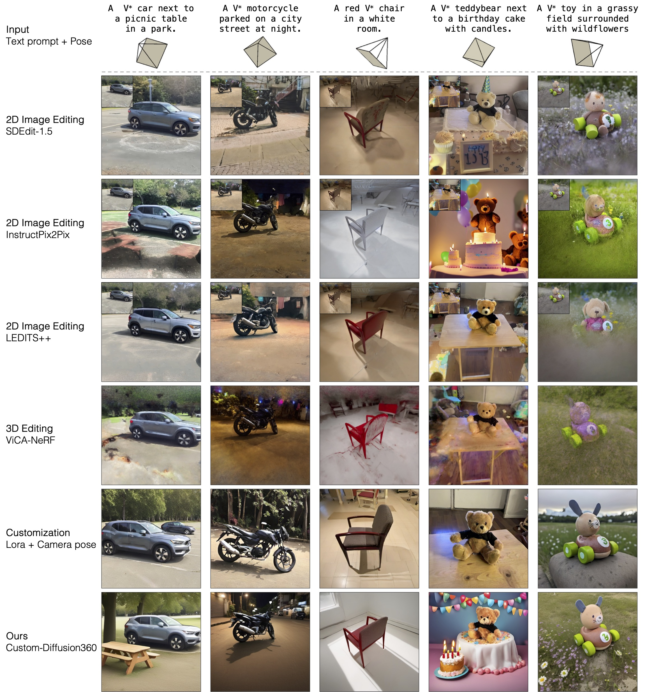
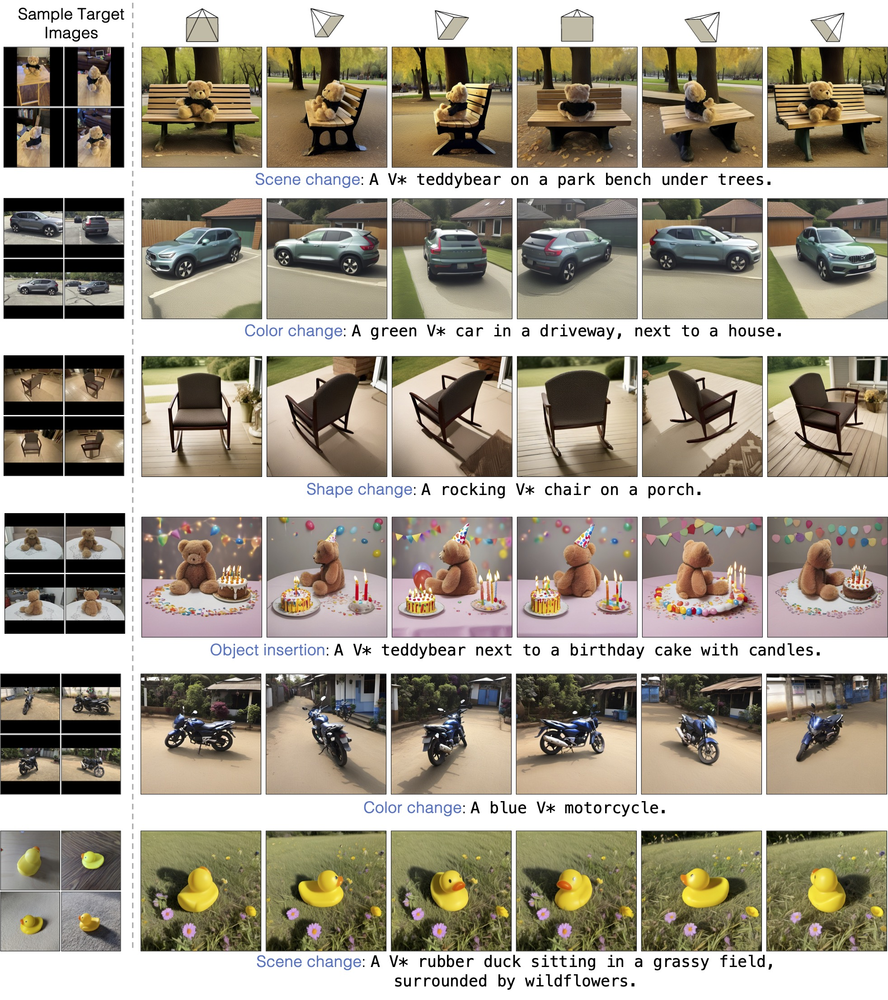
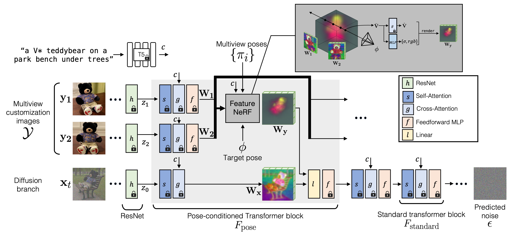

# Custom Diffusion 360

### [website](https://customdiffusion360.github.io)  | [paper](http://arxiv.org/abs/2404.12333) 


https://github.com/customdiffusion360/custom-diffusion360/assets/167265500/67b30422-5b82-4ee2-95a0-26c2e74154f8


[Custom Diffusion 360](https://customdiffusion360.github.io) allows you to control the camera viewpoint of the custom object in generated images by text-to-image diffusion models, such as [Stable Diffusion](https://github.com/Stability-AI/generative-models). Given a 360-degree multiview dataset (~50 images), we fine-tune FeatureNeRF blocks in the intermediate feature space of the diffusion model to condition the generation on a target camera pose. 

**Customizing Text-to-Image Diffusion with Camera Viewpoint Control** <br>
[Nupur Kumari](https://nupurkmr9.github.io/)<sup>*</sup>, [Grace Su](https://graceduansu.github.io/)<sup>*</sup>, [Richard Zhang](https://richzhang.github.io/), [Taesung Park](https://taesung.me/) [Eli Shechtman](https://research.adobe.com/person/eli-shechtman/), [Jun-Yan Zhu](https://www.cs.cmu.edu/~junyanz/)<br>
<br>


## Results

All of our results are based on the [SDXL](https://huggingface.co/stabilityai/stable-diffusion-xl-base-1.0) model.
We customize the model on various categories of multiview images, e.g., car, teddybear, chair, toy, motorcycle. For more generations and comparisons with baselines, please refer to our [webpage](https://customdiffusion360.github.io).

### Comparison to baselines

<div>
<p align="center">

</p>
</div>

### Generations with different target camera pose


<div>
<p align="center">

</p>
</div>


## Method Details


<div>
<p align="center">

</p>
</div>


Given multi-view images of an object with its camera pose, our method customizes a text-to-image diffusion model with that concept with an additional condition of target camera pose. We modify a subset of transformer layers to be pose-conditioned. This is done by adding a new FeatureNeRF block in intermediate feature space of the transformer layer. We finetune the new weights with the multiview dataset while keeping pre-trained model weights frozen. Similar to previous model customization methods, we add a new modifier token V* in front of the category name, e.g., V* car.


## Getting Started

```
git clone https://github.com/nupurkmr9/custom-diffusion-360.git
cd custom-diffusion-360
conda create -n pose python=3.8 
conda activate pose
pip install torch==2.1.0 torchvision==0.16.0 torchaudio==2.1.0 --index-url https://download.pytorch.org/whl/cu118
pip install -r requirements.txt
```
We also use `pytorch3D` in our code. Please look at the instructions to install that [here](https://github.com/facebookresearch/pytorch3d/blob/main/INSTALL.md). Or you can follow the below steps to install from source: 

```
conda install -c conda-forge cudatoolkit-dev -y
export CUDA_HOME=$CONDA_PREFIX/pkgs/cuda-toolkit/"
pip install "git+https://github.com/facebookresearch/pytorch3d.git@stable"
```

Download the stable-diffusion-xl model checkpoint:
```
mkdir pretrained-models
cd pretrained-models
wget https://huggingface.co/stabilityai/stable-diffusion-xl-base-1.0/resolve/main/sd_xl_base_1.0.safetensors
wget https://huggingface.co/stabilityai/sdxl-vae/resolve/main/sdxl_vae.safetensors
```

## Inference with provided models

**Download pretrained models:**
```
gdown 1LM3Yc7gYXuNmFwr0s1Z-fnH0Ik8ttY8k -O pretrained-models/car0.tar
tar -xvf pretrained-models/car0.tar -C pretrained-models/
```
We provide all customized models [here](https://drive.google.com/drive/folders/17EfDutJzme_4JG-KWzxp6LYNfbqh4LmW?usp=sharing)

**Sample images:**

```
python sample.py --custom_model_dir pretrained-models/car0 --output_dir outputs --prompt "a <new1> car beside a field of blooming sunflowers." 
```

## Training

**Dataset:**

We share the 14 concepts (part of [CO3Dv2](https://github.com/facebookresearch/co3d) and [NAVI](https://navidataset.github.io)) that we used in our paper for easy experimentation. The datasets are redistributed under the same licenses as the original works. 

```
gdown 1GRnkm4xp89bnYAPnp01UMVlCbmdR7SeG
tar -xvzf  data.tar.gz
```

**Train:**

```
python main.py --base configs/train_co3d_concept.yaml --name car0 --resume_from_checkpoint_custom  pretrained-models/sd_xl_base_1.0.safetensors --no_date  --set_from_main --data_category car  --data_single_id 0
```

**Your own multi-view images + Colmap:**
to be released soon. 

## Evaluation: to be released


## Referenced Github repos
Thanks to the following for releasing their code. Our code builds upon these. 

**[Stable Diffusion-XL](https://github.com/Stability-AI/generative-models)**
**[Relpose-plus-plus](https://github.com/amyxlase/relpose-plus-plus/tree/main)**
**[GBT](https://github.com/mayankgrwl97/gbt)**


## Bibliography

```
@article{kumari2024customdiffusion360,
  title={Customizing Text-to-Image Diffusion with Camera Viewpoint Control},
  author={Kumari, Nupur and Su, Grace and Zhang, Richard and Park, Taesung and Shechtman, Eli and Zhu, Jun-Yan},
  journal = {Arxiv},
  year      = {2024}
}
```

## Acknowledgments
We are thankful to Kangle Deng, Sheng-Yu Wang, and Gaurav Parmar for their helpful comments and discussion and to Sean Liu, Ruihan Gao, Yufei Ye, and Bharath Raj for proofreading the draft. This work was partly done by Nupur Kumari during the Adobe internship. The work is partly supported by Adobe Research, the Packard Fellowship, the Amazon Faculty Research Award, and NSF IIS-2239076. Grace Su is supported by the NSF Graduate Research Fellowship (Grant No. DGE2140739).
